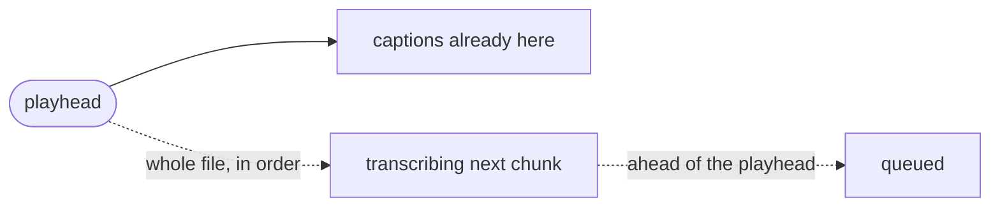
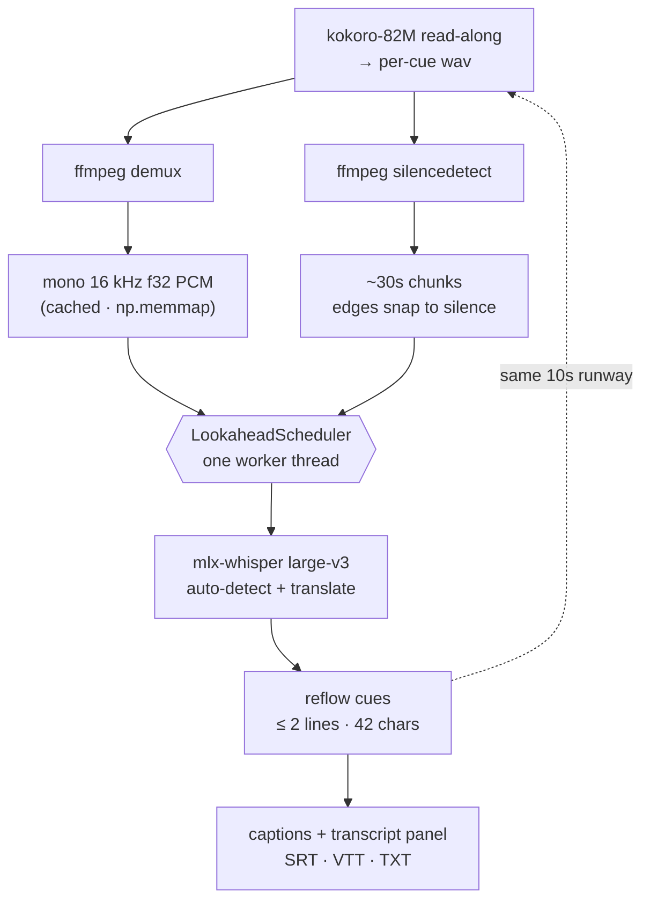
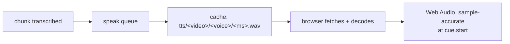
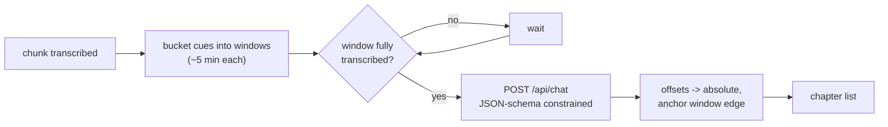

<div align="center">

# overhear-subs

**Subtitles that pull up before you do.**

Play a local video — the words are already on screen when the scene reaches them.

[](https://github.com/sharathkrml/overhear-subs)
[](pyproject.toml)
[](#quickstart)
[](LICENSE)

</div>

---

## The idea

> Transcribe what's **about to play**, before you get there.



An 88-second clip is cut into 3 chunks. Transcription runs **eagerly**: the worker
sweeps the whole file from the first chunk, as fast as the GPU allows, so it is
normally well past wherever the playhead is.

| Playhead | Scheduler |
| --- | --- |
| Playing | keeps transcribing ahead of you |
| Paused | keeps going — the GPU does **not** rest |
| Rewound | re-serves from cache, never re-runs the model |

Everything stays on your machine. The only network hit is the one-time model download from Hugging Face.

---

## Pipeline



<details>
<summary><b>What each stage does</b></summary>

| Stage | Detail |
| --- | --- |
| **Demux** | `ffmpeg` → mono 16 kHz float32 PCM, cached by `path + size + mtime`. Loaded as `np.memmap`, so seeking is just `SAMPLE_RATE * seconds` — an array index. No decode-on-the-fly, no VAD. |
| **Chunking** | `plan_chunks` cuts ~30s windows; `silencedetect` (≥0.4s below −35 dB) nudges each edge up to ±6s so words never split mid-vowel. |
| **Scheduler** | One thread, one rule: run the chunks in order from the first, back-filling anything a seek skipped. The chunk you're about to hit jumps the queue; the rest fills in afterwards. |
| **Whisper** | `mlx-community/whisper-large-v3-mlx` on the Apple GPU. Built-in `task="translate"` renders any spoken language as English in a single pass. Full `large-v3`, not turbo — turbo silently ignores translation. |
| **Reflow** | `reflow_cues` splits long segments into ≤ 2 balanced lines (≤ 42 chars), re-timed proportionally. CJK hard-wraps. No 3rd line covering the actor's face. |

**Unplayable files.** The browser decides what plays and the extension lies. `probe_codecs` serves browser-safe files untouched; otherwise `PlaybackPrep` transcodes once to H.264/AAC in a background thread (hardware `h264_videotoolbox`) with a live progress bar. Failure isn't fatal — the original is served and the reason shown.

</details>

---

## Quickstart

Requires **macOS on Apple Silicon**, plus `ffmpeg` and `uv`. For read-along, `espeak-ng`.

```sh
brew install ffmpeg uv        # + espeak-ng if you want read-along
make setup        # install deps
make run          # http://localhost:8000
```

Open <http://localhost:8000> → **Open Video…**. That's a native macOS panel, not a web upload — nothing is copied, nothing leaves the machine. First run downloads the model (~3 GB, one time); after that it's resident and offline.

---

## Controls

```text
play/pause · −10s · +10s · volume+mute · time · speed · CC · PiP · fullscreen
```

| Keys | Action | Keys | Action |
| --- | --- | --- | --- |
| `⌘O` | Open a video | `M` | Mute |
| `Space` / `K` | Play / pause | `0`–`9` | Jump to 0–90% |
| `←` / `→` | Seek 5s (`⇧` = 30s) | `Home` / `End` | Start / end |
| `J` / `L` | Seek 10s | `,` / `.` | Frame step (paused) |
| `↑` / `↓` | Volume | `<` / `>` | Playback speed |
| `C` | Toggle captions | `F` | Fullscreen |
| `R` | Read the translation aloud | | |
| `P` | Picture-in-picture | `?` | Shortcut list |
| `Esc` | Cancel in-progress open | | |

Drag the timeline to scrub — it doubles as a pipeline meter, one cell per chunk. Click a transcript line to seek; **Copy** a line on hover or the whole transcript from the header.

---

## Configuration

| Variable | Default | Purpose |
| --- | --- | --- |
| `HF_TOKEN` | — | Hugging Face token (also `HUGGING_FACE_HUB_TOKEN`) |
| `LT_LOOKAHEAD` | `10.0` | how much transcript in front of the playhead turns the "caught up" indicator green. Display only — transcription runs eagerly to the end of the file and this does **not** gate or pause the worker |
| `LT_CHUNK` | `30.0` | chunk length in seconds; shorter means a seek waits less for captions |
| `LT_TRANSLATE_MODEL` | `mlx-community/whisper-large-v3-mlx` | ASR repo (must be translate-capable) |
| `LT_REMUX` | `1` | convert unplayable files to browser-safe mp4 (`0` disables) |
| `LT_TTS` | `0` | read-along on at open (`1` enables; the **Speak** button works either way) |
| `LT_TTS_MODEL` | `mlx-community/Kokoro-82M-4bit` | read-along voice repo |
| `LT_TTS_VOICE` | `af_heart` | default voice (28 in the picker) |
| `LT_TTS_LANG` | `a` | Kokoro language code, `a` = American English |
| `LT_OLLAMA_URL` | `http://127.0.0.1:11434` | Ollama endpoint for chapter titles |
| `LT_CHAPTER_MODEL` | `qwen3:8b` | Ollama model that names the topics |
| `LT_CHAPTER_AIM` | `300` | transcript seconds per chapter call, before clamping |
| `LT_CHAPTER_MIN` | `180` | floor on `LT_CHAPTER_AIM` |
| `LT_CHAPTER_MAX` | `480` | ceiling on `LT_CHAPTER_AIM` |
| `LT_CACHE` | `~/.cache/overhear-subs` | derived PCM + remuxed mp4 |
| `LT_CACHE_MAX` | `4096` | ceiling on that directory in MB; least-recently-used entries are pruned at boot and after every open. `0` disables |
| `PORT` | `8000` | server port (`make run` / `make dev`) |

Set them inline, or copy `.env.example` to `.env` — the Makefile includes it and
exports whatever's set, so `make run`, `make dev`, and `make test` all see it.
Only `make` loads `.env`; running `uvicorn` directly won't (use `uvicorn --env-file .env`).

```sh
HF_TOKEN=hf_xxx LT_LOOKAHEAD=15 make run
```

**One language profile:** Auto → English, single pass. Swap the model via `LT_TRANSLATE_MODEL`; `large-v3-turbo` won't work (it ignores `task="translate"`).

---

## Read-along

Press **Speak** (or `R`) and the English translation is spoken over the video, with the
original audio ducked to 15%. Pick a voice from the dropdown; each voice caches
separately, so switching back is instant.

It rides the same sweep the transcriber already does. A cue is spoken the moment its
chunk lands, which on a paused or slow-churning video can be long before the playhead
reaches it — so playback stays instant and gapless, and scrubbing into a region you've
already transcribed never waits. `Kokoro-82M-4bit` measured **12.7× realtime** on an M1 Pro,
which puts the slowest of eight test cues at 0.38s. A cue that would overrun its own
subtitle window is re-spoken once, faster, so a fast talker doesn't get clipped.

Scheduling is Web Audio against `video.currentTime`, so the dub stays locked through seeks,
stalls, and 0.5×–2× playback. Seeking into the middle of a line resumes mid-sentence
instead of restarting the cue.



The wavs are the export interface: a dubbed track is `ffmpeg -i video -i <concatenated> -c copy`
against that same directory, with no re-synthesis.

**Needs `espeak-ng`** (`brew install espeak-ng`) — every small open English TTS needs a
grapheme-to-phoneme step, and Kokoro's is misaki's. The app finds Homebrew's copy on both
Apple Silicon and Intel prefixes; override with `PHONEMIZER_ESPEAK_LIBRARY` and
`PHONEMIZER_ESPEAK_DATA_PATH` if it's somewhere else.

---

## Chapters

A local Ollama model names the topic as the transcript is produced. Chapters get three
surfaces, because the app is used in three different postures:

| Surface | Where | What it is for |
| --- | --- | --- |
| **Panel list** | right side | Browsing. A thumbnail per chapter, so it's scannable rather than a wall of text. |
| **Timeline lane** | under the meter | Scrubbing. Segments **proportional to each chapter's span**, plus a caption naming the chapter you're currently in. |
| **Rail** | over the video, from the **Chapters** button | Fullscreen. Fullscreen hides the panel *and* the cursor, so hover is unreachable there — this is a deliberate toggle. |

The lane and the caption live inside the stage, so they ride into fullscreen. The rail does not
follow the transport's 2.6 s auto-hide: it's navigation, not transport, so it stays until you
dismiss it. Active chapter is painted on all three surfaces at once — panel row, lane segment,
and rail card.

Hovering a lane segment or a panel row pops a card with the frame the chapter starts on, its
title, and `0:00 – 0:26`. Clicking a lane segment goes to that chapter's start, not to the pixel
under the cursor. Rail cards carry their own frame, so they opt out of the hover card rather
than showing two thumbnails at once.

The preview card is `position: absolute` **inside `.frame`**, which matters twice: native
fullscreen only renders its own subtree, so a card parked on `<body>` silently vanishes in
fullscreen; and being inside the frame means it can never spill past the video and it paints
over the caption and transport. (It can't be `position: fixed` on `<body>` either — `.panel`
and `.banner` use `backdrop-filter`, which makes them a containing block for fixed descendants.)

Frames come from `GET /api/frame?start=<seconds>`, which input-seeks ffmpeg (`-ss` *before* `-i`,
so a two-hour video costs ~70ms rather than a full decode) and caches the JPEG by time — hover
twice, fetch once. It reads the **source** file, not the remuxed copy, because ffmpeg decodes
whatever codec is there, which is exactly the case the browser can't play. Audio-only input has
no frame, so the route 404s and the card falls back to text.

Cues are bucketed into fixed windows of transcript and each window is summarised once it is
fully transcribed. The window is only **how much context one call gets**: the model returns its
own cuts inside it, so a passage that holds one topic yields one chapter and a fast-moving one
yields four. The window length is derived from the video — `LT_CHAPTER_AIM` (5 min) rounded up
to a whole number of windows and clamped to `LT_CHAPTER_MIN`/`LT_CHAPTER_MAX` — so a 20-minute
video gets four windows and a 2-hour film gets twenty-four.



Decoding is constrained by a JSON schema, so there is no prose to parse. Timestamps go to the
model as `[mm:ss]` offsets from the start of the window — asking an 8B model for a position two
hours into a file reliably produces mush — and the previous chapter's title goes along with the
prompt so consecutive windows don't repeat themselves.

Windows are always taken lowest-index-first, so the backfill sweep after a seek fills in the
chapters the seek skipped over.

**Chapters trail the transcript, not the playback.** A chapter summarises a window of
transcript, so it can't exist until that window *has been transcribed* — which happens as
fast as the GPU gets through the file, not as you watch it. On a long video the whole list
usually appears while you're still on the first few minutes. Summarising needs the words
it summarises, so some delay is unavoidable; how much depends on transcript speed, not
playback.

**Needs Ollama running with the model already pulled.** `ollama pull qwen3:8b`. The app checks
`/api/tags` and stays off if the model isn't there, because `/api/chat` will happily pull a
missing model and that's a multi-GB download nobody asked for. Until then the strip says so
instead of rendering blank.

---

## Limits (the honest part)

- **The whole file gets transcribed.** Eagerly, from the first chunk — pausing does not pause
  the GPU, and a two-hour video will be fully transcribed whether or not you watch it all.
  That's the trade for scrubbing anywhere instantly and for chapters filling in ahead of you.
- **A chunk that fails is retried, then skipped.** Three attempts, then it's recorded as a gap
  so the sweep can continue; the status line keeps saying which chunk was dropped.
- **One video at a time.** `/media` serves the current file; opening another cancels what's in flight.
- **Cached conversions are re-probed** — a stale cache is discarded, not served.
- **The cache is bounded, not permanent.** Entries are keyed by `path + size + mtime`, so
  re-editing a video orphans its old entry; `LT_CACHE_MAX` (4 GB default) prunes
  least-recently-used ones at boot and after every open. Pruning is logged at warning level,
  so you'll see what it dropped. Everything it removes is re-derivable — PCM and remuxed
  copies come back from ffmpeg, TTS audio from Kokoro. `make cache-status` reports the
  current total; `make cache-clean` deletes it all.
- **File panel uses `osascript`** (`app.py:choose_file`). macOS may ask once to control System Events (only to bring the panel forward); denied = panel may open behind the browser. Non-macOS falls back to a path field.
- **Chunk planning re-runs `silencedetect`** on every open (fast, audio-only); PCM extraction is cached.
- **Chapters trail the transcript** — see above. A summary can't exist before the words it
  summarises, so the delay tracks transcription speed rather than how much you've watched.
- **Chapter titles can repeat a window later.** The previous title is in the prompt and an 8B
  model still occasionally lands on the same name; there is no de-duplication pass over the final
  list, because that costs another LLM call per chapter for a cosmetic gain.
- **The chapter model competes for unified memory** with Whisper. `keep_alive: 10m` evicts it
  once chapters stop coming, but on a 16 GB Mac a large `LT_CHAPTER_MODEL` alongside
  `whisper-large-v3` will slow transcription — drop to `qwen3:4b` if you see it.
- **Read-along is English-only.** Whisper translates to English, and Kokoro is strongest in
  English, so speaking the translation is the coherent path. Other Kokoro languages need
  `LT_TTS_LANG` and a matching Whisper target language.
- **Read-along needs espeak-ng**, one more system dependency than the rest of the app.
- **Cues can overlap.** A line spoken faster than `TTS_MAX_SPEED` (1.6×) is allowed to bleed
  into the next one rather than be cut off mid-word.
- **One shared GPU.** Whisper and Kokoro hold weights in the same unified memory. A seek
  saturates the ASR and TTS goes briefly late; the queue absorbs it, the audio just arrives
  later.
- **Settings are stateless** — volume, speed, captions, read-along and sidebar reset per
  session. No localStorage.

---

## Design & tests

UI follows Apple's fluid-interface guidance: feedback on pointer-*down*, 1:1 timeline tracking via `setPointerCapture`, translucent `backdrop-filter` chrome, tabular numerals on clocks. Honors `prefers-reduced-motion`, `prefers-reduced-transparency`, `prefers-contrast`, and `prefers-color-scheme`. Transcript rows are keyboard-reachable, transport fully labeled, every control has a focus ring.

```sh
make test    # chunk planning, scheduler, reflow, format detection — fake backend, no model/ffmpeg
make dev     # auto-reload        make run PORT=9000
make check   # byte-compile      make clean / make cache-clean
make cache-status   # what the media cache is holding
```

All Python goes through `uv` — no manual venv activation.

---

## License

[MIT](LICENSE) — do whatever, just keep the copyright notice.
